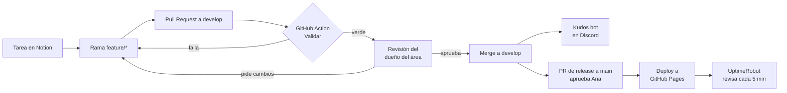

# Dengue Inc — Roadmap

> Documento vivo del equipo. Última actualización: **8 de octubre de 2026** · el juego ya está publicado en [GitHub Pages](https://jared-rodriguezdelacruz.github.io/dengue_inc/).
> Todo lo que va en Notion está en [`docs/notion/`](notion/): la portada, las páginas del equipo y las bases de datos de tareas, kudos y minutas, listas para importarse.

**Contenido:** [1. Visión](#1-visión-y-propósito) · [2. Equipo](#2-equipo-y-roles) · [3. Dónde estamos](#3-dónde-estamos) · [4. Fases](#4-fases) · [5. Calendario](#5-calendario-por-semana) · [6. Tareas](#6-tareas) · [7. Herramientas](#7-herramientas-todas-gratuitas) · [8. Terminado](#8-definición-de-terminado) · [9. Riesgos](#9-riesgos) · [10. Demo Day](#10-demo-day-guion-sugerido)

---

## 1. Visión y propósito

**Visión del producto.** Que cualquier persona en Aguascalientes aprenda jugando que el dengue se previene en su propio patio: el mosquito nace en agua *limpia* guardada en casa, y la única solución que dura es cerrar el criadero con la medida correcta — **Lava, Tapa, Voltea y Tira**.

**Propósito del equipo.** Construir un juego web educativo de calidad usando solo herramientas gratuitas, con un flujo de trabajo ordenado (todo cambio pasa por revisión), automatizaciones que reconocen el buen trabajo y una cultura en la que nos damos crédito unos a otros.

**Cómo sabremos que lo logramos**

| Métrica | Meta | Dónde se mide |
|---|---|---|
| Juego publicado y disponible | ≥ 99 % de uptime | Página de estado pública de UptimeRobot |
| Cambios revisados | 100 % de lo que entra a `main` llega por PR aprobado | Reglas de rama de GitHub |
| Calidad automática | 100 % de los PRs fusionados con CI en verde | GitHub Actions |
| Participación | Los 5 integrantes con al menos 2 PRs fusionados | GitHub → Insights → Contributors |
| Avance | 100 % de las tareas P0 hechas el 29 de noviembre | Gráfica de avance en Notion |
| Reconocimiento | 5 de 5 integrantes dieron y recibieron kudos | Discord #kudos + Notion |
| Producto | El juego se termina de principio a fin, con música, sin errores | Plan de pruebas, 2 playtests y testing final |
| Aprendizaje | En los playtests, el quiz sube de antes a después de jugar (meta: 4 de 5 o más al final) | Quiz del juego (DI-474) en los playtests (DI-485) |

---

## 2. Equipo y roles

| Integrante | Rol | Es dueño de | Sus PRs los revisa |
|---|---|---|---|
| **Ana** | CEO / Project Manager | Visión y prioridades, tablero de Notion, contenido educativo y sus fuentes, presentación del Demo Day. Aprueba los releases a `main` | Ivan |
| **Jared** | Backend | Motor, generación procedural, IA, física, guardado, reproductor y mezclador de audio, CI/CD y despliegue | Mau |
| **Gael** | Música y sonido | Música, efectos de sonido y mezcla | Jared |
| **Mau** | Frontend | Todo lo visual: HTML/CSS, HUD, menús, tienda, render 2D, mundo 3D con Three.js, efectos visuales, marca y accesibilidad | Jared |
| **Ivan** | QA, métricas y documentación | Plan de pruebas, playtests, testing final, UptimeRobot, métricas, README y CONTRIBUTING, evidencias y videos de cada paso | Ana |

**Quién decide qué**

- **Qué se hace y en qué orden:** Ana, con el tablero de Notion.
- **Cómo se implementa:** el dueño del área.
- **Qué entra a `develop`:** un PR con CI en verde y 1 aprobación de alguien que no sea el autor (GitHub asigna al dueño del área con CODEOWNERS). Ivan además prueba cada release antes de que llegue a `main`.
- **Qué entra a `main` (lo publicado):** el PR de release, aprobado por Ana.
- **Bloqueos de más de 24 h:** se levantan en `#daily` y los resuelve Ana.

---

## 3. Dónde estamos

**Avance al 8 de octubre: 55 de 131 tareas hechas (42 %) y 4 de las 7 fases cerradas (F0 a F3).** El juego está publicado en [GitHub Pages](https://jared-rodriguezdelacruz.github.io/dengue_inc/) y monitoreado en la [página de estado de UptimeRobot](https://stats.uptimerobot.com/KSFC94VXhP). Cada cambio entra por PR revisado, con CI y bot de kudos en Discord. Lo que sigue es F4 (audio, pulido, el rediseño educativo que pidió la maestra y los bugs y mejoras que salieron del juego publicado) y el cierre (F5 y F6).

El juego está completo y se puede jugar de principio a fin: unas 7,000 líneas de JavaScript sin dependencias (salvo Three.js), **5 niveles procedurales** (1, 3 y 4 en 2D; 2 y 5 en 3D en primera persona), jefe de dos fases, transición dimensional, final con Güero y una capa educativa en la que cada dato cita su fuente.

| Área | Estado | Qué hay / qué falta |
|---|---|---|
| Motor y entrada | ✅ Listo | PRNG con semilla, dt normalizado, teclado, ratón y mando |
| Mundo 2D | ✅ Listo | Funciona a la perfección (Jared y Gael): 8 plantillas de chunk validadas, 4 tipos de mosquito, jefe de 2 fases. Solo falta acelerar la fase 2 del jefe (DI-462) |
| Mundo 3D | ✅ Listo | Salas procedurales, muros instanciados, brújula. Vienen el nivel 4 en 3D, el jefe 3D y plataformas (DI-463 a DI-465) |
| Capa educativa | 🟡 Rediseño | La maestra pidió repensar cómo enseñamos: casi todo se leía y el juego premiaba matar mosquitos. En la rama `feature/educacion-rediseno` ya está casi todo (DI-471 a DI-484 y DI-486): cerrar criaderos paga, quiz antes y después, repaso y retos entre niveles, ciclo de vida, lluvia, Ivan en fase febril, Modo Patio, «Aprende» y «Revisa tu casa». Son 25 fichas, 5 mitos y 5 realidades, todo con fuente. Faltan la revisión de Ana (DI-484), medir en los playtests (DI-485) y los niveles en lugares reales (DI-487) |
| Flujo de equipo | ✅ Listo | Notion, Discord, ramas protegidas, PRs con revisión, plantillas y CODEOWNERS. Falta subir `CONTRIBUTING.md` (DI-202) |
| Automatización | ✅ Listo | *Validar* y *Título del PR* en cada PR; el bot de kudos felicita en Discord cada PR fusionado |
| Publicación y monitoreo | ✅ Listo | GitHub Pages con cache-busting por commit, UptimeRobot cada 5 min y badges en el README |
| Bugs del juego publicado | 🟡 En curso | 2 bugs P0 (la vida del HUD y el ratón en el final con Güero) y 9 mejoras, repartidas en F4 por área |
| Audio | 🟡 Parcial | 12 efectos sintetizados; **no hay música** ni control de volumen (DI-401 a DI-412 y DI-470) |
| Interfaz y marca | 🟡 Parcial | HUD y menús completos; faltan el menú principal nuevo (DI-469), créditos, opciones, nombre único, favicon y etiquetas meta (DI-456) |
| Accesibilidad y celular | 🔴 Falta | Los serotipos se distinguen solo por color; no se pueden reducir destellos; no se puede jugar en celular (DI-430) |
| Guardado | 🔴 Falta | Nada persiste entre sesiones |

---

## 4. Fases

| Fase | Fechas | Objetivo | Paso | Hito de salida |
|---|---|---|---|---|
| **F0 · Prototipo jugable** ✅ | 11 – 29 sep | Tener el juego completo | — | Build `b5`: 5 niveles, mando, capa educativa |
| **F1 · Organización del equipo** ✅ | 30 sep – **6 oct** | Que el equipo trabaje en un solo lugar, con roles claros | Paso 1 | Link de Notion con visión, propósito y roles |
| **F2 · Flujo de trabajo en GitHub** ✅ | 7 – 13 oct | Que todo cambio se pida y se apruebe por PR | Paso 2 | Ramas protegidas, CONTRIBUTING y primer PR revisado |
| **F3 · Automatización y publicación** ✅ | 14 – 27 oct | Que el buen trabajo se valide y se celebre solo, y que el juego esté en línea | Pasos 3 y 4 | Video de 30 s del bot · link público de UptimeRobot |
| **F4 · Audio, pulido y calidad** | 7 oct – 24 nov | Música completa, los bugs y mejoras del juego publicado, y el juego listo para enseñarse | — | Música en todos los niveles, P0 y P1 hechas, 2 playtests |
| **F5 · Cultura y cierre** | 18 – 29 nov | Reconocimiento visible y producto terminado | Paso 5 | Kudos de los 5, slides y **release v2.0 (29 nov)** |
| **F6 · Testing final y Demo Day** | 30 nov – 4 dic | Probar la versión final y presentarla | Paso 6 | Presentación y evaluación entre equipos |

---

## 5. Calendario por semana

Las semanas van de **miércoles a martes** para que cada entrega caiga en martes, como la del Paso 1 (6 de octubre). La S9 es corta: cierra el domingo 29 de noviembre con el proyecto terminado, y la primera semana de diciembre queda solo para testing y presentación.

> Si el profesor fija otras fechas para los pasos 2 a 5, solo se mueven esas filas. Si falta tiempo, se recortan primero las tareas **P2**, luego las **P1**; las **P0** no se mueven.

| Semana | Fechas | Fase | Paso | Entrega de la actividad | Foco en el juego |
|---|---|---|---|---|---|
| S0 | 11 – 29 sep | F0 | — | — | Prototipo `b5` (hecho) |
| S1 | 30 sep – 6 oct | F1 | **1** | **6 oct:** link del workspace de Notion ✅ | Juego publicado en GitHub Pages ✅ |
| S2 | 7 – 13 oct | F2 | **2** | **13 oct:** flujo de GitHub documentado y configurado ✅ | Bugs P0 (vida del HUD, ratón con Güero), dirección musical, marca, Three.js local, plan de pruebas |
| S3 | 14 – 20 oct | F3 | **3** | **20 oct:** video de 30 s de la automatización ✅ | Mezclador de audio, favicon y etiquetas meta, incentivos educativos (cerrar criaderos paga, abate y fichas que faltaban) |
| S4 | 21 – 27 oct | F3 | **4** | **27 oct:** link de la página de estado de UptimeRobot ✅ | Reproductor de música, tema del menú, créditos, fase 2 del jefe 2D, contenido nuevo con fuentes, repaso entre niveles y mito o realidad |
| S5 | 28 oct – 3 nov | F4 | — | — | Tema 2D, menú estilo Katana Zero, opciones, guardado, nivel 4 en 3D, aviso en celular, «Revisa tu casa» |
| S6 | 4 – 10 nov | F4 | — | — | Tema 3D, SFX nuevos, accesibilidad, tutorial 2D y 3D, skins de Güero e Ivan, rendimiento, quiz antes y después, Modo Patio, Ivan en fase febril |
| S7 | 11 – 17 nov | F4 | — | — | Tema del jefe y del final, música integrada, jefe 3D, gato aliado, playtest 1, ciclo de vida en el criadero, repelente e insecticida, submenú Aprende |
| S8 | 18 – 24 nov | F4 · F5 | **5** | Kudos de los 5 y su evidencia | Bugs del playtest, playtest 2 con medición de aprendizaje, jugar en celular, plataformas 3D, extras P2 (lluvia, triage, niveles en lugares reales) |
| S9 | 25 – 29 nov | F5 | **5** | Slides y video de respaldo · **29 nov: release v2.0, proyecto terminado** | Código congelado |
| S10 | 30 nov – 4 dic | F6 | **6** | Presentación en vivo · evaluación entre equipos | Testing final (solo arreglos P0) |

**Rituales desde S1:** daily asíncrona en `#daily` (ayer / hoy / bloqueos) · revisión del tablero los lunes · **kudos los viernes**. Así el Paso 5 es costumbre y no un trámite de última semana, y en S8 ya habrá varias semanas de evidencia.

---

## 6. Tareas

**Prioridad:** **P0** imprescindible para el Demo Day · **P1** importante · **P2** deseable (se recorta primero).
**Entrega:** fecha límite de la tarea. **Est.:** horas estimadas. **(+ nombre)** = quien apoya.

### Resumen por integrante

| Integrante | Rol | Tareas hechas | Pendientes | Pendientes P0 | Horas estimadas pendientes |
|---|---|---|---|---|---|
| Ana | CEO / Project Manager | 12 | 9 | 4 | 25.5 |
| Jared | Backend | 22 | 24 | 10 | 84 |
| Gael | Música y sonido | 2 | 10 | 6 | 38.5 |
| Mau | Frontend | 11 | 19 | 3 | 77 |
| Ivan | QA, métricas y documentación | 8 | 11 | 5 | 22.5 |
| Todos | — | 0 | 3 | 3 | 1 |
| **Total** | | **55** | **76** | **31** | **248.5** |

Cada tarea cuenta para su responsable; quien apoyó aparece como «(+ nombre)». Por ejemplo, Gael en todo el mundo 2D (DI-008 a DI-011).

### F0 · Prototipo jugable — ✅ hecho (11 – 29 sep)

| ID | Tarea | Responsable | Archivos | Qué incluye |
|---|---|---|---|---|
| DI-001 | Definir concepto, público y propuesta educativa del juego | Ana (+ Todos) | `README.md` | Juego web de acción y aprendizaje sobre prevención del dengue en Aguascalientes: cerrar criaderos, frenar contagios y salvar a Güero. |
| DI-002 | Investigar los datos del dengue con fuentes verificables | Ana (+ Ivan) | `js/01b-datos-dengue.js` | 10 envases con su medida correcta, 4 serotipos, señales de alarma, 21 fichas, 5 mitos y cifras reales de Aguascalientes y México. Fuentes: OMS, CDC, SSA, COFEPRIS, PLOS. |
| DI-003 | Documentar el proyecto en el README | Ivan (+ Ana) | `README.md` | Descripción, estructura de archivos, cómo ejecutar, controles de teclado y mando, capa educativa. |
| DI-004 | Núcleo del motor: configuración, estados, PRNG con semilla y colisiones | Jared | `js/01-nucleo.js` | Tiempos en frames a 60 fps con dt normalizado (independiente del framerate); mulberry32 para niveles reproducibles por semilla; colisión AABB. |
| DI-005 | Sistema de entrada con detección de flancos (teclado y ratón) | Jared | `js/01-nucleo.js` | pulsada()/abajo(); acciones globales T (tienda), C (fichero), Esc (pausa), M (silencio), F3 (debug). |
| DI-006 | Jugador compartido 2D/3D: vida, estamina, dash, esquive y raqueta | Jared | `js/03-jugador.js` | Frames de invulnerabilidad, cooldowns y castigo por parry fallido. |
| DI-007 | Sistema de enfermedad: serotipos, fase febril y crítica, inmunidad y dengue grave | Jared (+ Ana) | `js/03-jugador.js` | Paracetamol vs ibuprofeno (AINE), vacuna Qdenga que reduce el riesgo pero no lo elimina. |
| DI-008 | Generación procedural 2D por chunks con validación de jugabilidad | Jared (+ Gael) | `js/04-mundo2d-gen.js` | 8 plantillas (llano, hueco, escalera, torre, flotantes, arena, criadero, tesoro); huecos y alturas limitados por la física real del salto. |
| DI-009 | Física y combate 2D | Jared (+ Gael) | `js/05-mundo2d-fisica.js` | Coyote time, buffer y salto variable; explosiones de barriles en cadena; armas: botas, repelente y abate. |
| DI-010 | IA 2D: 4 tipos de mosquito y criaderos que reponen enemigos | Jared (+ Gael) | `js/06-mundo2d-ia.js` | Zumbador, picador, enjambre (boids) y mutante; máximo 2 atacantes a la vez; aviso obligatorio antes de cada ataque. |
| DI-011 | Jefe final 2D de dos fases | Jared (+ Gael y Mau) | `js/06-mundo2d-ia.js`, `js/07-mundo2d-dibujo.js` | Fase 1: devolver el orbe con la raqueta para bajar el escudo. Fase 2: esquivar la embestida y golpear el núcleo. |
| DI-012 | Generación procedural 3D por salas | Jared (+ Mau) | `js/08-mundo3d-gen.js` | Salas conectadas con pasillos y atajos; BFS para poner la meta en la sala más lejana; salas de inicio, arena, criadero, botín y meta. |
| DI-013 | IA 3D de mosquitos y proyectiles | Jared (+ Mau) | `js/10-mundo3d-ia.js` | Culling por distancia de niebla, separación entre mosquitos, parry 3D del orbe morado. |
| DI-014 | Bucle principal, hitstop, manejo de errores y overlay de depuración (F3) | Jared | `js/12-bucle.js` | FPS, ms de lógica y estadísticas de generación en pantalla; un error no deja la pantalla tapada. |
| DI-015 | Soporte de mando (Gamepad API) | Jared (+ Mau) | `js/01c-mando.js`, `README.md` | Xbox, PlayStation, Nintendo y genéricos; navegación de paneles con cruceta; vibración; autofuego en 3D. |
| DI-016 | Maqueta HTML: marco de 960×540 con rieles laterales | Mau | `index.html` | Fichero, tienda y panel de Güero viven a los lados: lo que se lee nunca tapa la acción. |
| DI-017 | Hoja de estilos: HUD, menús, paneles y animaciones | Mau | `css/estilos.css` | Viñeta, estado febril y crítico, animación de la grieta, diseño adaptable a pantallas medianas. |
| DI-018 | HUD: corazones, estamina, cooldowns, fiebre, serotipos y casos en la colonia | Mau | `js/11-flujo.js` |  |
| DI-019 | Menús: principal con semilla, pausa, derrota, entre niveles y final | Mau | `js/11-flujo.js` | La pantalla entre niveles resume criaderos cerrados, casos y derriba un mito. |
| DI-020 | Tienda de prevención con 6 productos | Mau (+ Ana) | `index.html`, `js/11-flujo.js` | Repelente, abate, suero, paracetamol, ibuprofeno y vacuna, cada uno con su dato de la vida real. |
| DI-021 | Render 2D en canvas | Mau | `js/07-mundo2d-dibujo.js` | Cielo, skyline, plataformas, 10 envases, mosquitos con banda de color por serotipo, jefe, jugador y raqueta. |
| DI-022 | Motor 3D con Three.js | Mau (+ Jared) | `js/08-mundo3d-gen.js` | Niebla, muros instanciados en una sola draw call, partículas 3D en una sola geometría. |
| DI-023 | Jugador 3D en primera persona | Mau | `js/09-mundo3d-jugador.js` | Pointer lock, movimiento, salto, disparo y viewmodel animado de la raqueta. |
| DI-024 | Efectos visuales con pools preasignados | Mau | `js/02-efectos.js` | 2400 partículas sin crear objetos dentro del bucle, ondas de choque, texto flotante, sacudida de cámara y hitstop. |
| DI-025 | Transición dimensional 2D → 3D (la grieta) | Mau (+ Jared) | `js/02-efectos.js`, `js/11-flujo.js` | Cortina robusta: aunque la pestaña pierda el foco, la pantalla nunca se queda en blanco. |
| DI-026 | Brújula 3D y aviso de medidas junto a un envase | Mau | `js/11-flujo.js` | La flecha apunta al criadero más cercano, luego a Güero y al final al portal. |
| DI-027 | Capa educativa: medidas LTVT, casos en la colonia, fichero y reportes | Ivan (+ Ana) | `js/11b-educacion.js` | 21 fichas que se desbloquean jugando, un mito por nivel, reporte final con cifras reales. |
| DI-028 | Final con Güero: rescate en fase crítica | Ivan (+ Ana) | `js/11c-guero.js` | El desenlace depende de dar el medicamento correcto, llegar a tiempo y haber cerrado los criaderos. Sin azar. |
| DI-029 | Efectos de sonido procedurales con WebAudio | Gael | `js/02-efectos.js` | 12 efectos sintetizados sin archivos: salto, dash, parry, parry fallido, golpe, daño, explosión, moneda, disparo, aviso de ataque, nivel y muerte. |
| DI-030 | Silenciar y activar el audio (M o botón View/Share del mando) | Gael (+ Jared) | `js/01-nucleo.js` |  |

### F1 · Organización del equipo — Paso 1 — ✅ hecho (30 sep – 6 oct)

| ID | Tarea | Responsable | Entrega | Prio. | Est. (h) | Criterio de aceptación |
|---|---|---|---|---|---|---|
| DI-101 | Crear el workspace de Notion e invitar al equipo | Ana | 6 oct | P0 | 1 | Workspace «Dengue Inc» con Ana como única miembro y los otros 4 como invitados con permiso de edición (así el plan gratis no tiene límite de bloques). Páginas y bases de datos importadas de docs/notion/. |
| DI-102 | Página «Visión y propósito del equipo» | Ana (+ Todos) | 6 oct | P0 | 1 | Visión, propósito y métricas de éxito en la portada 🦟 Dengue Inc. |
| DI-103 | Página «Roles y fortalezas» | Ana (+ Todos) | 6 oct | P0 | 1 | Cada integrante escribe su fortaleza y por qué toma su rol; queda quién revisa los PRs de quién. |
| DI-104 | Importar el tablero de tareas y crear sus vistas | Ana | 6 oct | P0 | 1 | Base de datos con vistas: tablero por Estado, por Responsable, línea de tiempo por Fecha límite y gráfica de avance. |
| DI-105 | Servidor de Discord con canales y roles | Ana (+ Ivan) | 6 oct | P0 | 1 | Canales #anuncios #general #daily #dev #github-bot #audio #diseño #kudos y uno de voz; un rol por área. |
| DI-106 | Rituales del equipo: daily, revisión del tablero y kudos semanales | Ana (+ Todos) | 6 oct | P1 | 2 | Daily en #daily (ayer / hoy / bloqueos); los lunes se revisa el tablero; los viernes, kudos en #kudos. |
| DI-107 | Entregar el link del workspace (Paso 1) | Ana | 6 oct | P0 | 0.5 | Link con permiso de lectura que muestra visión, propósito y roles. Entrega: 6 de octubre. |

### F2 · Flujo de trabajo en GitHub — Paso 2 — ✅ hecho, falta subir CONTRIBUTING.md (7 – 13 oct)

| ID | Tarea | Responsable | Entrega | Prio. | Est. (h) | Criterio de aceptación |
|---|---|---|---|---|---|---|
| DI-201 | Invitar a los 5 como colaboradores del repositorio | Jared | 13 oct | P0 | 0.5 | Todos aceptan la invitación y pueden crear ramas y abrir PRs. |
| DI-202 | CONTRIBUTING.md: ramas, formato de commits y cómo pedir y aprobar cambios | Ivan (+ Jared) | 13 oct | P0 | 2 | Flujo feature/* → develop → main, Conventional Commits y checklist de revisión. |
| DI-203 | Plantillas de Pull Request y de issues (bug / mejora) | Jared (+ Ivan) | 13 oct | P0 | 1 | Cada PR pide: qué cambia, tarea de Notion, cómo probarlo y checklist de terminado. |
| DI-204 | CODEOWNERS por área | Jared | 13 oct | P1 | 0.5 | Audio → Gael; HTML, CSS, 2D y 3D → Mau; datos educativos → Ana; docs → Ivan; motor → Jared. GitHub pide la revisión solo. |
| DI-205 | Proteger las ramas main y develop | Jared | 13 oct | P0 | 0.5 | PR obligatorio, 1 aprobación de alguien que no sea el autor, sin push directo ni force push. El check «Validar» se vuelve obligatorio en cuanto exista (DI-301). |
| DI-206 | Etiquetas del repositorio por área y prioridad | Ivan | 13 oct | P2 | 0.5 | area:audio, area:frontend, area:backend, area:docs, area:qa, P0, P1, P2, bug. |
| DI-207 | Primer PR real siguiendo el flujo: subir el roadmap | Jared (+ Ana) | 13 oct | P0 | 0.5 | PR de docs/ROADMAP.md y docs/notion/ hacia develop, revisado y aprobado por Ana. |
| DI-208 | Evidencia del Paso 2 | Ana (+ Jared) | 13 oct | P0 | 0.5 | Capturas de las reglas de protección y del PR revisado (DI-207). Entrega: 13 de octubre. |

### F3 · Automatización y publicación — Pasos 3 y 4 — ✅ hecho (14 – 27 oct)

| ID | Tarea | Responsable | Entrega | Prio. | Est. (h) | Criterio de aceptación |
|---|---|---|---|---|---|---|
| DI-301 | GitHub Action «Validar» en cada PR | Jared | 20 oct | P0 | 3 | Falla si: un .js tiene error de sintaxis, index.html carga un script que no existe, los ?v= no coinciden con BUILD, o una ficha o mito no cita fuente. Queda como check obligatorio en main y develop. |
| DI-302 | Validar el título del PR (Conventional Commits) | Jared | 20 oct | P1 | 1 | «cambios» falla; «feat(audio): tema del menú» pasa. |
| DI-303 | Webhook de Discord guardado como secreto en GitHub | Ana (+ Jared) | 20 oct | P0 | 0.5 | Webhook del canal #github-bot guardado como secreto DISCORD_WEBHOOK; nunca en el código. |
| DI-304 | GitHub Action «Kudos bot»: felicitar en Discord cada PR fusionado | Jared | 20 oct | P0 | 2 | Al fusionar un PR llega a Discord un mensaje con autor, revisor, título y enlace, en segundos. |
| DI-305 | Video de 30 s de la automatización (Paso 3) | Ivan (+ Ana) | 20 oct | P0 | 1 | En una sola toma: PR → CI en verde → merge → mensaje en Discord. Entrega: 20 de octubre. |
| DI-306 | Publicar el juego en GitHub Pages desde main | Jared | 27 oct | P0 | 1 | https://jared-rodriguezdelacruz.github.io/dengue_inc/ carga el juego y se actualiza en cada merge a main (Pages gratis requiere repo público). |
| DI-307 | Cache-busting automático al desplegar | Jared | 27 oct | P1 | 1 | El deploy cambia ?v= y BUILD por el SHA del commit: ya no hay que subirlos a mano. |
| DI-308 | Monitor de UptimeRobot para la página del juego | Ivan (+ Jared) | 27 oct | P0 | 0.5 | Monitor tipo Keyword (busca «Dengue» en la página) cada 5 min; alertas por correo al equipo. |
| DI-309 | Página de estado pública de UptimeRobot (Paso 4) | Ivan | 27 oct | P0 | 0.5 | Link público en el README, en Notion y en las slides. Entrega: 27 de octubre. |
| DI-310 | Badges en el README (CI, deploy, uptime) | Ivan | 27 oct | P2 | 0.5 |  |
| DI-311 | Gráfica de avance en Notion (% de tareas hechas) | Ana | 27 oct | P1 | 0.5 | Vista de gráfica por Estado en la base de tareas. |

### F4 · Juego: audio, pulido y calidad (7 oct – 24 nov)

#### Audio y música — Gael

| ID | Tarea | Responsable | Entrega | Prio. | Est. (h) | Criterio de aceptación |
|---|---|---|---|---|---|---|
| DI-401 | Dirección musical y lista de pistas | Gael (+ Ana) | 13 oct | P0 | 2 | Llenar la página 🎵 Dirección musical (ya creada en Notion): referencias, BPM e instrumentación por contexto (menú, 2D, 3D, jefe, final) y la decisión: pistas propias o con licencia libre (CC0). |
| DI-402 | Mezclador de audio: buses master, música y SFX | Jared (+ Gael) | 20 oct | P0 | 3 | Hoy cada sonido va directo a la salida. Todo pasa por GainNodes y M silencia también la música. |
| DI-403 | Reproductor de música con transiciones suaves | Jared (+ Gael) | 27 oct | P0 | 4 | Crossfade al cambiar de nivel o de estado; arranca con el clic de Iniciar; sigue funcionando al abrir index.html con doble clic (HTMLAudioElement, no fetch). |
| DI-404 | Tema del menú principal | Gael | 27 oct | P0 | 5 | Loop limpio de 60 a 90 s en MP3, menos de 1.5 MB. |
| DI-405 | Tema de los niveles 2D (la colonia) | Gael | 3 nov | P0 | 6 | Energía de plataformas; deja espacio para que se escuchen los SFX. |
| DI-406 | Tema de los niveles 3D (laberinto con niebla) | Gael | 10 nov | P0 | 6 | Más ambiental y tenso que el tema 2D. |
| DI-407 | Efectos de sonido nuevos | Gael | 10 nov | P1 | 5 | Uno por medida (lava, tapa, voltea, tira), zumbido de mosquito posicional en 3D, pasos en 3D, sonidos de UI, ficha desbloqueada y portal. |
| DI-408 | Tema del jefe con subida de intensidad en la fase 2 | Gael | 17 nov | P1 | 5 | Capa extra o pista distinta al romperse el escudo. |
| DI-409 | Música del final con Güero y jingles de victoria y derrota | Gael | 17 nov | P1 | 4 | Latido que se acelera con su fase crítica; un jingle por desenlace. |
| DI-410 | Música adaptativa a la fiebre | Gael (+ Jared) | 24 nov | P2 | 2 | Filtro paso-bajo en fase febril, más marcado en fase crítica; se quita al curarse. |
| DI-411 | Reusar los buffers de ruido en ruido() | Jared (+ Gael) | 10 nov | P2 | 1 | Hoy se crea un buffer nuevo en cada golpe o explosión; se precalcula una sola vez. |
| DI-412 | Créditos y licencias del audio | Gael | 24 nov | P0 | 0.5 | Autor y licencia de cada pista en el README y en la pantalla de créditos. |
| DI-470 | Integrar las pistas de música en el juego | Gael (+ Jared) | 17 nov | P0 | 3 | Las pistas MP3 llegan a audio/ y cada una se conecta a su contexto (menú, 2D, 3D, jefe y final) con el reproductor (DI-403). Su autor y licencia van en DI-412. |

#### Frontend: 2D, 3D e interfaz — Mau

| ID | Tarea | Responsable | Entrega | Prio. | Est. (h) | Criterio de aceptación |
|---|---|---|---|---|---|---|
| DI-420 | Unificar la marca «Dengue Inc» | Mau (+ Ana) | 13 oct | P0 | 2 | Hoy conviven «Dengue Inc» (README), «Dengue: Multiverso» (menú) y «Dengue: Multiverso Aguascalientes v2» (pestaña). Un solo nombre y logo; el favicon va en DI-456. |
| DI-421 | Incluir Three.js dentro del repositorio | Mau | 13 oct | P0 | 0.5 | Hoy se carga del CDN: sin internet los niveles 2 y 5 no funcionan. Copia local de r128 como respaldo. |
| DI-422 | Pantalla de créditos con el equipo y sus roles | Mau | 27 oct | P0 | 2 | Se abre desde el menú y al terminar el juego; incluye créditos de audio. |
| DI-423 | Menú de opciones | Mau (+ Gael) | 3 nov | P1 | 4 | Volumen de música y SFX, sensibilidad 3D, reducir destellos y sacudidas; se guarda entre sesiones (DI-440). Es el submenú Opciones del menú principal (DI-469). |
| DI-424 | Aviso en celulares y pantallas pequeñas | Mau | 3 nov | P1 | 1 | El Demo Day se abrirá el link desde celulares: explicar que se juega con teclado o mando. |
| DI-425 | Serotipos distinguibles sin depender del color (2D y 3D) | Mau | 10 nov | P1 | 4 | DENV-2 (rojo) y DENV-4 (verde) se confunden con daltonismo: añadir número o patrón en mosquitos y proyectiles. |
| DI-426 | Tutorial interactivo en el primer nivel 2D y el primer 3D | Mau (+ Jared) | 10 nov | P1 | 7 | Carteles contextuales la primera vez. En 2D: moverse, saltar, dash, raqueta y las 4 medidas. En 3D: mirar con el ratón, disparar, rodar y seguir la brújula. |
| DI-427 | Pulido visual 3D: texturas procedurales y luz por tipo de sala | Mau | 17 nov | P2 | 6 |  |
| DI-428 | Fichero con filtros por categoría y animación de ficha nueva | Mau (+ Ivan) | 17 nov | P2 | 3 |  |
| DI-429 | Modelos 3D más detallados de los envases | Mau | 24 nov | P2 | 6 | Con primitivas de Three.js, sin archivos externos. Güero pasa a DI-466. |
| DI-430 | Jugar en celular: controles táctiles en 2D y 3D | Mau (+ Jared) | 24 nov | P1 | 10 | Stick y botones en pantalla para 2D y 3D (en 3D se mira arrastrando el dedo), en horizontal y sin zoom accidental. Cuando esté listo, reemplaza el aviso de DI-424. |
| DI-466 | Skin low poly de Güero (melena de león) | Mau (+ Jared) | 10 nov | P1 | 5 | A partir de la imagen de referencia: en 3D con primitivas de Three.js (low poly) y en 2D un sprite que lo distinga. Su rasgo: la melena de león. |
| DI-467 | NPC de Ivan (con gorra): otro caso de dengue | Mau (+ Ivan) | 10 nov | P1 | 4 | Otro vecino con dengue en un nivel distinto al de Güero, con su propia skin low poly (rasgo: la gorra) a partir de la imagen de referencia. |
| DI-469 | Menú principal estilo Katana Zero con submenús | Mau (+ Jared) | 3 nov | P1 | 6 | Pantalla de título con estética Katana Zero y submenús: Jugar (con semilla), Opciones (DI-423), Ayuda y controles, y Créditos (DI-422). Se navega con teclado, ratón y mando. |
| DI-479 | «Lo que aprendiste en este nivel» | Mau (+ Ivan) | 27 oct | P1 | 1.5 | La pantalla entre niveles lista las fichas que se abrieron en ese nivel; durante la pelea el aviso de ficha nueva se acorta. El repaso queda en la pausa, que es cuando sí se lee. |
| DI-480 | Mito o realidad entre niveles | Mau (+ Ana) | 27 oct | P1 | 3 | Entre niveles salen dos afirmaciones y hay que contestar MITO o REALIDAD antes de ver la explicación con su fuente; acertar da 2 monedas. Mitos y realidades se alternan para que «mito» a ciegas no sirva. Funciona con ratón, teclas 1-4 y mando. |
| DI-481 | Ivan: el caso de la fase febril | Mau (+ Ana) | 10 nov | P1 | 6 | Contenido educativo de DI-467. Ivan (low poly, con gorra) está junto al portal del nivel 2 y solo se le atiende con la cuadra sin criaderos. Tres decisiones con su explicación y fuente: qué darle (paracetamol y suero), cómo cuidar a su familia (repelente y mosquitero) y cuándo ir a urgencias (señales de alarma). Falta ajustar la skin con la imagen de referencia (DI-467). |
| DI-482 | «Revisa tu casa» al terminar | Mau (+ Ana) | 3 nov | P1 | 2 | La pantalla final trae la lista de envases con su medida para imprimir o compartir por WhatsApp: el juego termina en el patio de verdad. |
| DI-483 | Submenú «Aprende» | Mau (+ Ana) | 17 nov | P2 | 4 | Botón «Aprende» en el menú principal (pasará al menú nuevo de DI-469): las 4 medidas, el mosquito, síntomas, qué hacer si te da dengue, mitos y realidades, y cifras, con sus fuentes. Ahí se ven todas las fichas como consulta; en la partida se siguen abriendo jugando. |

#### Backend y sistemas — Jared

| ID | Tarea | Responsable | Entrega | Prio. | Est. (h) | Criterio de aceptación |
|---|---|---|---|---|---|---|
| DI-440 | Guardado local de opciones y progreso | Jared | 3 nov | P1 | 3 | Opciones, fichas desbloqueadas y mejor resultado por semilla en localStorage; si el navegador lo bloquea, el juego sigue funcionando. |
| DI-441 | Minimapa 3D | Jared (+ Mau) | 17 nov | P2 | 5 | Salas descubiertas, criaderos pendientes y portal. |
| DI-442 | Selector de dificultad | Jared (+ Ana) | 17 nov | P2 | 3 | Fácil y Normal: vida, daño y ritmo de los criaderos. |
| DI-443 | Logros dentro del juego | Jared (+ Mau) | 24 nov | P2 | 4 | Por ejemplo «Cerraste 10 criaderos sin atajos» o «Salvaste a Güero»; aparecen en el reporte final. |
| DI-444 | Arreglar los bugs críticos del playtest | Jared (+ Mau) | 24 nov | P0 | 4 | Todo hallazgo P0 del playtest 1 (DI-454) queda cerrado antes del playtest 2. |
| DI-460 | Arreglar: la vida del HUD no se actualiza al recibir daño | Jared (+ Mau) | 13 oct | P0 | 2 | Al recibir daño, los corazones del HUD no bajan en ese momento. Cada golpe y cada curación se ven al instante, en 2D y en 3D, también después de reintentar un nivel. |
| DI-461 | Arreglar: no se pueden elegir con el ratón las opciones para salvar a Güero | Jared (+ Ivan) | 13 oct | P0 | 1 | Hoy el cursor no se mueve sobre las opciones y hay que abrir la tienda con T para liberarlo. Al abrirse el panel de Güero el ratón queda libre y cada opción se elige con clic, teclado o mando. |
| DI-462 | Jefe 2D: fase 2 más rápida pero igual de difícil | Jared (+ Gael) | 27 oct | P1 | 3 | La fase 2 dura de más. Que se resuelva en menos tiempo (embestidas más seguidas o núcleo con menos vida) sin quitar el aviso antes de cada ataque ni bajar el reto. |
| DI-463 | Jefe final en 3D | Jared (+ Mau) | 17 nov | P1 | 8 | Sala de arena con un jefe propio del modo 3D y aviso antes de cada ataque, como el jefe 2D. En qué nivel queda se decide junto con DI-464. |
| DI-464 | Nivel 4 en 3D: dos niveles 2D y dos 3D | Jared (+ Mau) | 3 nov | P1 | 3 | Hoy NIVEL_ES_2D marca 1, 3 y 4 como 2D, y el jefe 2D vive en el 4. Quedan 1 y 3 en 2D y 2 y 4 en 3D; el jefe 2D se mueve a un nivel 2D y el 5 sigue siendo el final con Güero. |
| DI-465 | Plataformas en los niveles 3D | Jared (+ Mau) | 24 nov | P2 | 5 | Plataformas y desniveles dentro de las salas, alcanzables con el salto 3D; la generación valida que la meta siga siendo alcanzable. |
| DI-468 | Gato aliado que ataca mosquitos (se compra en la tienda) | Jared (+ Mau) | 17 nov | P2 | 6 | Aliado inspirado en la Gorda (imagen de referencia): se compra en la tienda y acompaña al jugador en 2D y 3D atacando a los mosquitos cercanos. |
| DI-471 | Cerrar criaderos paga; matar mosquitos casi no | Jared (+ Ana) | 20 oct | P0 | 2 | Hoy las monedas salen de matar mosquitos y cerrar un criadero no da nada, justo lo contrario de la ficha «Matar mosquitos no sirve». La medida correcta da 3 monedas (el abate 2), el mosquito que sale de un criadero vivo no suelta moneda y el reporte final compara mosquitos aplastados contra criaderos cerrados. |
| DI-472 | El abate solo cierra lo que guarda agua | Jared (+ Ana) | 20 oct | P0 | 1 | Hoy su explosión cierra cualquier criadero del radio y con 10 💰 te saltas las 4 medidas. Solo cierra tinacos, cisternas y tambos (verbo «tapa»); en lo demás avisa qué medida pide. Igual en 2D y 3D. |
| DI-473 | Desbloquear las fichas «Pica de día» y «Vuela menos de 100 m» | Jared (+ Ivan) | 20 oct | P0 | 1 | Hoy ningún evento las abre y el fichero se queda en 19/21. «Pica de día» se abre con la primera picadura; «Vuela menos de 100 m» al cerrar un criadero, cuando sus mosquitos se dispersan. |
| DI-474 | Quiz antes y después de jugar | Jared (+ Ana) | 10 nov | P0 | 5 | 5 preguntas al pulsar Iniciar (se pueden saltar y no revelan la respuesta) y las mismas antes del final, ya con su explicación y fuente: «Antes 2/5 → Después 5/5». Cada resultado se guarda en el navegador (localStorage «dengueinc.quiz») para los playtests (DI-485). Preguntas en 01b-datos-dengue.js, validadas por el CI. Complementa DI-457. |
| DI-475 | Modo Patio: inspeccionar una casa de Aguascalientes | Jared (+ Mau) | 10 nov | P1 | 8 | Botón «Modo Patio» en el menú: una casa con azotea y patio, sin enemigos. Hay que encontrar los 10 envases y aplicar la medida correcta contra reloj, con ratón, teclado o mando; lo vaciado sin tallar revive. Estrellas por tiempo, errores y atajos, y mejor tiempo guardado. Usa la misma regla (resultadoVerbo) y el mismo dibujo de envases que la partida. |
| DI-476 | Ciclo de vida visible en el criadero | Jared (+ Mau) | 17 nov | P1 | 4 | Cada criadero activo muestra la etapa de su cría (huevos → larvas → pupas) con una barra, en 2D sobre el envase y en 3D en el aviso de medidas; al completarse sale el mosquito. La primera cría tarda más y cerrarlo antes de que nazca el primero da +2 monedas. Ficha nueva «De huevo a mosquito en una semana» (CDC). Las semillas siguen dando los mismos niveles. |
| DI-477 | Repelente que protege, insecticida que no resuelve | Jared (+ Mau) | 17 nov | P2 | 3 | El arma que dispara pasa a ser «Insecticida», y comprarla abre la ficha «Matar mosquitos no sirve». El repelente es consumible (4 monedas): 30 s en que casi no te pican, con contador en el HUD y ficha propia. |
| DI-478 | La lluvia reactiva los criaderos | Jared (+ Gael) | 24 nov | P2 | 4 | Una vez por nivel llueve, entre los 45 y los 70 s: lo vaciado sin tallar revive al instante. Al escampar sale «Después de llover, revisa el patio» y una ficha nueva. |

#### Calidad, documentación y contenido — Ivan y Ana

| ID | Tarea | Responsable | Entrega | Prio. | Est. (h) | Criterio de aceptación |
|---|---|---|---|---|---|---|
| DI-450 | Plan de pruebas por nivel | Ivan | 13 oct | P0 | 3 | Checklist de los 5 niveles con teclado y con mando, en Chrome, Edge y Firefox. |
| DI-451 | Semillas de regresión | Ivan (+ Jared) | 3 nov | P1 | 1 | 3 a 5 semillas fijas documentadas para reproducir bugs. |
| DI-452 | Prueba de rendimiento con el overlay F3 | Ivan (+ Mau) | 10 nov | P1 | 2 | En la laptop más modesta del equipo: 60 fps en 2D y al menos 45 en 3D. |
| DI-453 | Revisión de exactitud del contenido educativo | Ana (+ Ivan) | 10 nov | P1 | 2 | Fuentes vigentes (OMS, SSA, COFEPRIS) y cifras de Aguascalientes actualizadas. |
| DI-454 | Playtest 1 con 3 a 5 personas externas | Ivan (+ Todos) | 17 nov | P1 | 3 | Cada hallazgo se registra como tarea en Notion con su prioridad. |
| DI-455 | Playtest 2 con los arreglos | Ivan (+ Todos) | 24 nov | P1 | 2 | Otras personas, misma checklist; confirma que los bugs críticos ya no aparecen. |
| DI-456 | Favicon, etiquetas meta y vista previa al compartir (Open Graph) | Ivan (+ Mau) | 20 oct | P1 | 1.5 | El juego ya está publicado: favicon, descripción, theme-color y Open Graph (título, descripción e imagen al pegar el link en Discord o WhatsApp). |
| DI-457 | Encuesta de aprendizaje al terminar (Google Forms) | Ana (+ Jared) | 24 nov | P2 | 2 | Botón en la pantalla final con 3 preguntas; respuestas en Sheets para medir el impacto educativo. |
| DI-484 | Contenido y fuentes de las secciones nuevas | Ana (+ Ivan) | 27 oct | P0 | 3 | Fichas nuevas (ciclo de vida, que no piquen al enfermo, repelente y lluvia), 5 realidades, 5 preguntas del quiz, 3 decisiones de Ivan y 3 casos de triage, cada uno con su fuente en 01b-datos-dengue.js. Falta que Ana revise la exactitud (DI-453). |
| DI-485 | Medir el aprendizaje en los playtests | Ivan (+ Ana) | 24 nov | P1 | 1 | En DI-454 y DI-455 se anota el quiz de antes y después de cada persona; el promedio va a las métricas de las slides (DI-503). |
| DI-486 | ¿Es dengue? Triage de vecinos | Ana (+ Mau) | 24 nov | P2 | 4 | En la pausa antes del nivel 4, en lugar de «¿mito o realidad?», dos vecinos con síntomas: en casa con paracetamol y suero, al centro de salud o a urgencias (señales de alarma). Cada caso con su explicación y fuente. |
| DI-487 | Niveles en lugares reales de Aguascalientes | Ana (+ Mau) | 24 nov | P2 | 6 | Patio → escuela → azotea → panteón (floreros, Día de Muertos) → la colonia de Güero, con los envases de cada lugar. Verificar con fuente las campañas en panteones (DI-453). |

### F5 · Cultura de reconocimiento y cierre — Paso 5 (18 – 29 nov)

| ID | Tarea | Responsable | Entrega | Prio. | Est. (h) | Criterio de aceptación |
|---|---|---|---|---|---|---|
| DI-501 | Cada integrante publica un kudos genuino a otro compañero | Todos | 24 nov | P0 | 0.5 | 5 mensajes en #kudos, en rotación para que todos den y reciban uno. |
| DI-502 | Evidencia de los kudos | Ana (+ Ivan) | 24 nov | P0 | 0.5 | Capturas de #kudos y de la galería 🏆 Kudos en Notion, incluidas las de semanas anteriores. |
| DI-503 | Métricas para las slides | Ivan | 29 nov | P0 | 1 | Uptime, PRs por integrante, % de tareas hechas, número de kudos y de ejecuciones de CI. |
| DI-504 | Slides del Demo Day | Ana (+ Mau) | 29 nov | P0 | 6 | 5 a 7 min: problema, demo, herramientas, cultura, métricas y aprendizajes (guion en la página 🎤 Demo Day). |
| DI-505 | Video de respaldo del gameplay | Ivan (+ Gael) | 29 nov | P0 | 3 | 1 a 2 min con la música nueva, por si falla la demo en vivo. |
| DI-506 | Release v2.0: proyecto terminado | Jared (+ Todos) | 29 nov | P0 | 1 | develop → main, tag v2.0 y notas de versión en GitHub Releases. A partir de aquí el código se congela. Fecha: 29 de noviembre. |

### F6 · Testing final y Demo Day — Paso 6 (30 nov – 4 dic)

| ID | Tarea | Responsable | Entrega | Prio. | Est. (h) | Criterio de aceptación |
|---|---|---|---|---|---|---|
| DI-601 | Testing final de la versión publicada | Ivan (+ Todos) | 4 dic | P0 | 3 | Plan de pruebas completo y semillas de regresión sobre GitHub Pages. Solo se arreglan bugs P0; lo demás se documenta. |
| DI-602 | Ensayo general cronometrado | Ana (+ Todos) | 4 dic | P0 | 1 | Menos de 7 min, con la demo y el video de respaldo listos. |
| DI-603 | Presentación en vivo | Todos | 4 dic | P0 |  |  |
| DI-604 | Formulario de evaluación entre equipos | Todos | 4 dic | P0 | 0.5 |  |
| DI-605 | Retrospectiva final en Notion | Ana (+ Todos) | 4 dic | P1 | 1 | En la página 🎤 Demo Day: qué funcionó, qué no y qué haríamos distinto. |

---

## 7. Herramientas (todas gratuitas)

### 7.1 Notion — el workspace del equipo (Paso 1)

```
🦟 Dengue Inc — portada: visión, propósito, métricas y enlaces (sección 1)
├── 👥 Roles y fortalezas (sección 2)
├── 🗺️ Roadmap — dónde estamos, fases, calendario y riesgos
├── ✅ Tareas — base de datos con las tareas de la sección 6
│     vistas: Tablero por Estado · Por responsable · Línea de tiempo · Esta semana · Gráfica de avance
├── 🔀 Flujo de trabajo — rituales, estados de una tarea, PRs y definición de terminado
├── 🏆 Kudos — base de datos
├── 📝 Minutas — base de datos con las revisiones de cada lunes
├── 📦 Entregas — cada paso de la actividad con su evidencia
├── 🎵 Dirección musical — la llena Gael (DI-401)
└── 🎤 Demo Day — guion, slides, métricas y checklists
```

**Importar:** todo está listo en `docs/notion/`. Primero se importa `Dengue Inc.md` como página raíz (*Importar → Texto y Markdown*). Dentro de ella, con `/zip`, se sube `Dengue Inc - paginas.zip`, que crea las demás páginas y las 3 bases de datos. Después se ajustan los tipos de propiedad: **Estado** → Estado; **Fecha límite** → Fecha; **Estimación (h)** → Número; **Responsable, Apoyo, Área, Fase, Semana, Prioridad, Paso de la actividad** → Selección.

### 7.2 Discord — comunicación

| Canal | Para qué |
|---|---|
| `#anuncios` | Solo Ana: fechas, entregas, decisiones |
| `#general` | Plática del equipo |
| `#daily` | Daily asíncrona: ayer / hoy / bloqueos |
| `#dev` | Dudas técnicas y revisión de PRs |
| `#github-bot` | Mensajes automáticos de GitHub Actions (felicitaciones por PR fusionado) |
| `#audio` · `#diseño` | Avances de música y de interfaz |
| `#kudos` | Reconocimientos entre compañeros (Paso 5) |
| 🔊 Voz | Reuniones y sesiones de trabajo |

### 7.3 GitHub — cómo se piden y aprueban cambios (Paso 2)

- **Ramas:** `main` = lo publicado (protegida) · `develop` = integración (protegida) · `feature/<área>-<descripción>` para trabajo nuevo (ej. `feature/audio-tema-menu`) · `fix/<descripción>` para arreglos.
- **Commits y títulos de PR** con [Conventional Commits](https://www.conventionalcommits.org/es/v1.0.0/): `feat(audio): tema del menú`, `fix(3d): la brújula apunta al revés`, `docs: roadmap`. Tipos: `feat`, `fix`, `docs`, `style`, `refactor`, `perf`, `test`, `chore`, `ci`.
- **Reglas de las ramas protegidas:** PR obligatorio, 1 aprobación, sin push directo ni force push. Desde el Paso 3, también CI en verde.



### 7.4 Automatización que valida y celebra el buen trabajo (Paso 3) — decisión

| | **GitHub Actions + webhook de Discord** | Zapier (plan gratis) | Make.com (plan gratis) |
|---|---|---|---|
| Costo | Gratis | Gratis: 100 tareas al mes, zaps de 2 pasos | Gratis con límite de operaciones |
| Qué tan rápido reacciona | Segundos | Revisa cada 15 min | Por intervalos, no al instante |
| Cuentas extra | Ninguna | Zapier + conectar Notion | Make + conectar Notion |
| Queda documentado en el repo | Sí (archivos YAML con historial) | No | No |
| Además valida el formato del trabajo | Sí | No | No |

**Decisión: GitHub Actions.** Cubre las dos opciones que pide el paso —validar el formato del trabajo y felicitar al equipo en Discord— y el video de 30 s se puede grabar sin esperar 15 minutos a que un zap se dispare.

Workflows (ya funcionando en `.github/workflows/`):

1. **`validar.yml`** (en cada PR): sintaxis de todos los `.js`; que cada `<script>` de `index.html` exista; que los `?v=` coincidan con `BUILD`; que **cada ficha y cada mito cite su fuente** (el formato de `01b-datos-dengue.js`); título del PR con Conventional Commits.
2. **`kudos.yml`** (al fusionar un PR): mensaje en `#github-bot`, por ejemplo:
   > 🎉 **¡PR fusionado!** Gael sumó *feat(audio): tema del menú* (#14) · revisó Mau · ✅ CI en verde
3. **`pages.yml`** (al actualizar `main`): cache-busting con el SHA del commit y deploy a GitHub Pages.

### 7.5 Métricas visibles (Paso 4) — decisión

**Decisión: UptimeRobot sobre GitHub Pages.** El plan gratis incluye 50 monitores revisados cada 5 minutos y una página de estado pública, que es justo el link que se entrega. El monitor será de tipo *Keyword* (busca «Dengue» en la página), así que no solo confirma que el servidor responde, sino que el juego carga. En el plan gratis las alertas llegan por correo.

Looker Studio queda descartado: Notion no se conecta directo y habría que exportar las tareas a Google Sheets a mano cada vez. Como métrica extra de avance usamos la gráfica de la base de tareas en Notion (DI-311).

---

## 8. Definición de terminado

Una tarea pasa a **Hecho** solo si:

- [ ] Entró por PR a `develop`, con la tarea de Notion enlazada y la plantilla llena.
- [ ] La GitHub Action **Validar** está en verde.
- [ ] La aprobó alguien que no es el autor.
- [ ] Se probó en Chrome y en Firefox; si toca controles, también con mando.
- [ ] El juego sigue abriéndose con **doble clic** en `index.html` (sin servidor): nada de módulos ES ni `fetch` de archivos locales.
- [ ] Si agrega un dato sobre el dengue, está en `js/01b-datos-dengue.js` con su fuente.
- [ ] Si agrega audio o imágenes de terceros, su licencia está en los créditos.

---

## 9. Riesgos

| Riesgo | Prob. | Impacto | Mitigación |
|---|---|---|---|
| Sin internet o Wi-Fi lento en el Demo Day | Media | Alto | Three.js local (DI-421), video de respaldo (DI-505) y el juego abre sin servidor |
| La música no está a tiempo | Media | Alto | Pistas con licencia libre como plan B; el reproductor (DI-403) no depende de las pistas finales |
| Conflictos de merge (varios tocan `11-flujo.js`) | Alta | Medio | PRs pequeños, actualizar la rama desde `develop` a diario, CODEOWNERS |
| El navegador bloquea el audio automático | Alta | Bajo | La música arranca con el clic de *Iniciar*, donde el juego ya desbloquea el audio |
| El navegador sirve JS viejo de la caché | Media | Medio | Cache-busting automático en el deploy (DI-307) |
| Se filtra el webhook de Discord | Baja | Medio | Solo como secreto de GitHub; si se filtra, se regenera en Discord |
| Mau concentra todo el frontend (2D, 3D e interfaz) | Media | Medio | Sus tareas extra son P2 y se recortan primero; Jared apoya en 3D y controles |
| El testing final encuentra algo grave sin tiempo para arreglarlo | Baja | Alto | Proyecto terminado el 29 nov, 2 playtests antes y en S10 solo se arreglan bugs P0 |
| Se pierde el ritmo a mitad de noviembre | Media | Medio | Rituales semanales y la gráfica de avance de Notion revisada cada lunes |
| Se sumaron 11 tareas (5 oct) con las mismas fechas | Alta | Medio | Los bugs P0 van primero (13 oct); las P2 nuevas (gato aliado, plataformas 3D) se recortan antes que cualquier otra |
| Faltan las imágenes de referencia (Güero, Ivan, la Gorda) | Media | Bajo | Se piden a Jared antes de S6; mientras, se modela con primitivas y se ajusta después |
| El rediseño educativo (DI-471 a DI-487) suma 58.5 h | Alta | Medio | Las P0 educativas (DI-471 a DI-474 y DI-484) van antes que cualquier extra; si falta tiempo se recortan primero las P2 que no enseñan nada (gato aliado DI-468, plataformas 3D DI-465) y luego las P2 educativas |

---

## 10. Demo Day: guion sugerido

| Tiempo | Quién | Qué |
|---|---|---|
| 0:00 – 1:30 | Ana | Intro (equipo y juego) y Notion: visión, roles y tablero de tareas (Paso 1) |
| 1:30 – 2:30 | Gael | Discord: canales, roles y el canal del bot |
| 2:30 – 4:30 | Jared | GitHub: ramas protegidas y flujo del PR (Paso 2) · GitHub Actions: Validar, Título del PR y Kudos bot, con el video de 30 s (Paso 3) |
| 4:30 – 5:30 | Mau | Revisión de PRs y publicación en GitHub Pages |
| 5:30 – 6:30 | Ivan | UptimeRobot y métricas (Paso 4), y links |

El guion completo, con qué decir y qué mostrar en cada parte, está en la página 🎤 Demo Day de Notion (`docs/notion/paginas/Demo Day.md`).
