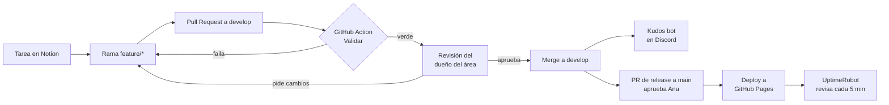

Cómo trabajamos como equipo: los rituales de cada semana y el camino que sigue cada cambio, desde la tarea en Notion hasta el juego publicado.

## Rituales

| Cuándo | Qué | Dónde |
|---|---|---|
| Todos los días | Daily asíncrona: ayer, hoy y bloqueos | Discord `#daily` |
| Lunes | Revisión del tablero: qué se atrasó, qué sigue y bloqueos de más de 24 h | Notion → 📝 Minutas |
| Viernes | Kudos: cada quien reconoce a un compañero por algo concreto | Discord `#kudos` y Notion → 🏆 Kudos |

Plantilla de la daily (está fijada en `#daily`):

```
📅 Daily
✅ Ayer: …
🎯 Hoy: …
🚧 Bloqueos: …
```

## Estados de una tarea

| Estado en ✅ Tareas | Cuándo | Qué pasa en GitHub |
|---|---|---|
| Por hacer | Nadie la ha empezado | — |
| En progreso | El responsable ya empezó | Rama `feature/…` creada desde `develop` |
| En revisión | Hay un PR abierto | PR a `develop` con el ID de la tarea en el título, esperando CI y aprobación |
| Hecho | El cambio ya entró | *Squash and merge* con CI en verde y 1 aprobación |

## Cómo se piden y aprueban los cambios

- **Ramas:** `main` = lo publicado (protegida) · `develop` = integración (protegida) · `feature/área-descripción` para trabajo nuevo (ej. `feature/audio-tema-menu`) · `fix/descripción` para arreglos.
- **Commits y títulos de PR** con [Conventional Commits](https://www.conventionalcommits.org/es/v1.0.0/): `feat(audio): tema del menú`, `fix(3d): la brújula apunta al revés`, `docs: roadmap`. Tipos: `feat`, `fix`, `docs`, `style`, `refactor`, `perf`, `test`, `chore`, `ci`.
- **Reglas de las ramas protegidas:** PR obligatorio, 1 aprobación, sin push directo ni force push. Desde el Paso 3, también CI en verde.



Si el diagrama se ve como código: clic en el bloque → **Vista previa** (si no aparece, elige *Mermaid* como lenguaje del bloque).

## Quién es dueño de qué y quién revisa

| Área | Dueño | Archivos | Sus PRs los revisa |
|---|---|---|---|
| Motor, IA, guardado, código de audio y CI | **Jared** | `js/01-nucleo.js`, `01c`, `03`–`06`, `08`, `10`, `12`, `.github/` | Mau |
| Frontend: 2D, 3D e interfaz | **Mau** | `index.html`, `css/`, `vendor/`, `js/02-efectos.js` (efectos), `07`, `09`, `11-flujo.js` | Jared |
| Música y sonido | **Gael** | `audio/`, sección de audio de `js/02-efectos.js` | Jared |
| Contenido educativo y gestión | **Ana** | `js/01b-datos-dengue.js` | Ivan |
| QA, métricas y documentación | **Ivan** | `README.md`, `CONTRIBUTING.md`, `docs/`, `js/11b`, `js/11c` (con Ana) | Ana |

Cada tarea la sube **su responsable, desde su propia cuenta**, por PR. Quien ayudó entra como coautor del commit. Así las revisiones, el bot de kudos y las métricas de GitHub reflejan quién hizo qué.

## Definición de terminado

Una tarea pasa a **Hecho** solo si:

- [ ] Entró por PR a `develop`, con la tarea de Notion enlazada y la plantilla llena.
- [ ] La GitHub Action **Validar** está en verde.
- [ ] La aprobó alguien que no es el autor.
- [ ] Se probó en Chrome y en Firefox; si toca controles, también con mando.
- [ ] El juego sigue abriéndose con **doble clic** en `index.html` (sin servidor): nada de módulos ES ni `fetch` de archivos locales.
- [ ] Si agrega un dato sobre el dengue, está en `js/01b-datos-dengue.js` con su fuente.
- [ ] Si agrega audio o imágenes de terceros, su licencia está en los créditos.

## Herramientas (todas gratuitas)

| Herramienta | Para qué | Por qué esta |
|---|---|---|
| Notion | Visión, roles, tareas, kudos, minutas y entregas | Plan gratis: Ana es la única miembro y los demás entran como invitados, así no hay límite de bloques |
| Discord | Comunicación diaria, kudos y mensajes del bot | Todos lo usamos; los webhooks son gratis |
| GitHub | Código, ramas protegidas y revisión de cada cambio por PR | Repo público: reglas de rama y Pages gratis |
| GitHub Actions | Validar cada PR y felicitar en Discord cada PR fusionado | Reacciona en segundos y queda documentado en el repo; Zapier gratis revisa cada 15 min |
| GitHub Pages | Publicar el juego en cada merge a `main` | Gratis en repos públicos |
| UptimeRobot | Revisar cada 5 min que el juego carga, con página de estado pública | Plan gratis: 50 monitores y 1 página de estado; Looker Studio no se conecta directo a Notion |
